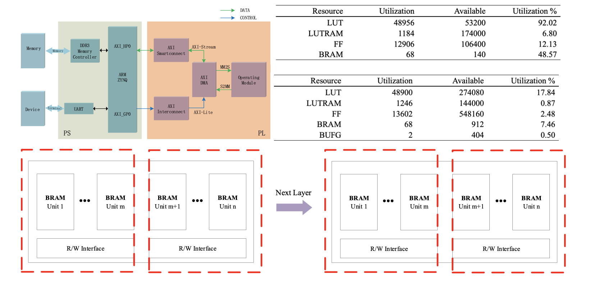

Hi! I am an undergraduate student in Software Engineering at [University of Electronic Science and Technology of China](https://www.uestc.edu.cn/).

My current research interests include neural network compression, efficient deep learning, FPGA, and transfer learning.

## Education Experience

+ [Sep. 2019 - Jun. 2023] **University of Electronic Science and Technology of China**
  + B.E. in Software  Engineering

## Research Experiences

+ [Jul. 2020 - Present] **University of Electronic Science and Technology of China**
  + Research Assistant

## Awards

+ 2021，National Second Prize of China Computer Design Competition
+ 2021，Provincial First Prize of China College Students' 'Internet+'Innovation and Entrepreneurship Competition
+ 2019&2020，The Second Prize Scholarship

## Selected Projects

**Quantization and Efficient Deployment of Neural Networks**

This project is to deploy a NN for analyzing radar echoes on a hardware platform with limited computing resources. We complete the quantization of the NN and the hardware implementation. After verifying the project on Xilinx's Zynq UltraScale+ MPSoC ZCU102 board, we furtherly deploy it on ZED-7020. Finally,we can reduce both the energy consumption and thecircuit areas significantly without affecting the performance. 
